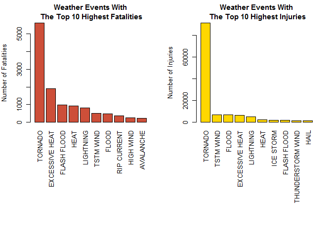
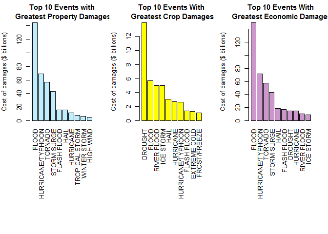

# Peer Graded Assignment: Course Project 2 - Population Health and Economic Effects of Weather Events
Ranil  
September 3, 2017  


## Synopsis

stroms and other severe weather events can cause both public health and economic problems for communities and municipalities. Many severe events can result in fatalities, injuries, and property damage, and preventing such outcomes to the extent possible is a key concern. This project involves exploring the U.S. National Oceanic and Atmospheric Administration's (NOAA) strom database, you can find it here <https://d396qusza40orc.cloudfront.net/repdata%2Fdata%2FstromData.csv.bz2>. 

This database tracks characteristics of major stroms and weather events in the United States, including when and where they occur, as well as estimates of any fatalities, injuries, and property damage. 

## Objective
The basic goal of this assignment is to explore the NOAA strom Database and answer some basic questions about severe weather events. Must use the database to answer the questions below and show the code for your entire analysis. 

Analysis will address address the following questions:

1. Across the United States, which types of events (as indicated in the EVTYPE variable) are most harmful with respect to population health?
2. Across the United States, which types of events have the greatest economic consequences?

## Data Processing

We will set the work directory to download the file and save it. Program will read the generated csv file. If the data already exists in the working environment, we do not need to load it again. Otherwise, we read the csv file.


```r
setwd("C:\\Users\\narra\\Documents\\GitHub\\RepData_PeerAssessment2")

if (!"RepDatastromData.csv.bz2" %in% dir("./")) {
    print("Downloading File.....")
    download.file("http://d396qusza40orc.cloudfront.net/repdata%2Fdata%2FstromData.csv.bz2", destfile = "RepDatastromData.csv.bz2")
}
if (!"strom" %in% ls()) {
strom <- read.csv(bzfile("RepDatastromData.csv.bz2"), sep = ",", header = TRUE, stringsAsFactors = FALSE)
}
dim(strom)
```

```
## [1] 902297     37
```

### Changing invalid PROPstromEXP and CROPstromEXP to 0

```r
strom$PROPDMGEXP <- ifelse(strom$PROPDMGEXP %in% c("B", "h", "H", "K", "m", "M"),  as.character(strom$PROPDMGEXP), "NONE")
strom$CROPDMGEXP <- ifelse(strom$CROPDMGEXP %in% c("B", "k", "K", "m", "M"),  as.character(strom$CROPDMGEXP), "NONE")
```

### Multiplying PROPstrom by factor of 10 based on EXP letter

```r
strom$PROPDMG <- strom$PROPDMG * (10^9 * (strom$PROPDMGEXP == "B") + 10^6 *(strom$PROPDMGEXP %in% c("m", "M")) + 10^3 * (strom$PROPDMGEXP %in% c("k", "K")) + 100 * (strom$PROPDMGEXP %in% c("h", "H")))

strom$CROPDMG <- strom$CROPDMG * (10^9 * (strom$CROPDMGEXP == "B") + 10^6 *(strom$CROPDMGEXP %in% c("m", "M")) + 10^3 * (strom$CROPDMGEXP %in% c("k", "K")) + 100 * (strom$CROPDMGEXP %in% c("h", "H")))

strom$TOTECODMG <- strom$PROPDMG+strom$CROPDMG
```

### Calculation: To find most harmful with respect to population health

```r
fatalities <- aggregate(FATALITIES ~ EVTYPE, data = strom, FUN = sum)
fatalities <- fatalities[order(fatalities$FATALITIES, decreasing = TRUE), ]
# 10 most harmful causes of fatalities
MaxFatalities <- fatalities[1:10, ]
print(MaxFatalities)  
```

```
##             EVTYPE FATALITIES
## 834        TORNADO       5633
## 130 EXCESSIVE HEAT       1903
## 153    FLASH FLOOD        978
## 275           HEAT        937
## 464      LIGHTNING        816
## 856      TSTM WIND        504
## 170          FLOOD        470
## 585    RIP CURRENT        368
## 359      HIGH WIND        248
## 19       AVALANCHE        224
```

```r
injuries <- aggregate(INJURIES ~ EVTYPE, data = strom, FUN = sum)
injuries <- injuries[order(injuries$INJURIES, decreasing = TRUE), ]
# 10 most harmful causes of injuries
MaxInjuries <- injuries[1:10, ]
print(MaxInjuries)
```

```
##                EVTYPE INJURIES
## 834           TORNADO    91346
## 856         TSTM WIND     6957
## 170             FLOOD     6789
## 130    EXCESSIVE HEAT     6525
## 464         LIGHTNING     5230
## 275              HEAT     2100
## 427         ICE STORM     1975
## 153       FLASH FLOOD     1777
## 760 THUNDERSTORM WIND     1488
## 244              HAIL     1361
```

```r
propdmg <- aggregate(PROPDMG ~ EVTYPE, data = strom, FUN = sum)
propdmg <- propdmg[order(propdmg$PROPDMG, decreasing = TRUE), ]
# 5 most harmful causes of Properties Damange
propdmgMax <- propdmg[1:10, ]
print(propdmgMax)
```

```
##                EVTYPE      PROPDMG
## 170             FLOOD 144657709800
## 411 HURRICANE/TYPHOON  69305840000
## 834           TORNADO  56937160480
## 670       STORM SURGE  43323536000
## 153       FLASH FLOOD  16140811510
## 244              HAIL  15732267220
## 402         HURRICANE  11868319010
## 848    TROPICAL STORM   7703890550
## 972      WINTER STORM   6688497250
## 359         HIGH WIND   5270046260
```

```r
cropdmg <- aggregate(CROPDMG ~ EVTYPE, data = strom, FUN = sum)
cropdmg <- cropdmg[order(cropdmg$CROPDMG, decreasing = TRUE), ]
# 5 most harmful causes of injuries
cropdmgMax <- cropdmg[1:10, ]
print(cropdmgMax)
```

```
##                EVTYPE     CROPDMG
## 95            DROUGHT 13972566000
## 170             FLOOD  5661968450
## 590       RIVER FLOOD  5029459000
## 427         ICE STORM  5022113500
## 244              HAIL  3025954450
## 402         HURRICANE  2741910000
## 411 HURRICANE/TYPHOON  2607872800
## 153       FLASH FLOOD  1421317100
## 140      EXTREME COLD  1292973000
## 212      FROST/FREEZE  1094086000
```

```r
ecodmg <- aggregate(TOTECODMG ~ EVTYPE, data = strom, FUN = sum)
ecodmg <- ecodmg[order(ecodmg$TOTECODMG, decreasing = TRUE), ]
# 5 most harmful causes of property damage
ecodmgMax <- ecodmg[1:10, ]
print(ecodmgMax)
```

```
##                EVTYPE    TOTECODMG
## 170             FLOOD 150319678250
## 411 HURRICANE/TYPHOON  71913712800
## 834           TORNADO  57352113590
## 670       STORM SURGE  43323541000
## 244              HAIL  18758221670
## 153       FLASH FLOOD  17562128610
## 95            DROUGHT  15018672000
## 402         HURRICANE  14610229010
## 590       RIVER FLOOD  10148404500
## 427         ICE STORM   8967041310
```
## Results

### Question 01 : Across the United States, which types of events (as indicated in the EVTYPE variable) are most harmful with respect to population health?
the following is a pair of graphs of Total Fatalities and Total Injuries caused by these Severe Weather Events.


<!-- -->

###Question 02 : Across the United States, which types of events have the greatest economic consequences?


```r
par(mfrow = c(1, 3), mar = c(15, 4, 3, 2), mgp = c(3, 1, 0), cex = 0.8)
barplot(propdmgMax$PROPDMG/(10^9), las = 3, names.arg = propdmgMax$EVTYPE, main = "Top 10 Events with\n Greatest Property Damages", ylab = "Cost of damages ($ billions)", col = "lightblue1")
barplot(cropdmgMax$CROPDMG/(10^9), las = 3, names.arg = cropdmgMax$EVTYPE, main = "Top 10 Events With\n Greatest Crop Damages", ylab = "Cost of damages ($ billions)", col = "yellow")
barplot(ecodmgMax$TOTECODMG/(10^9), las = 3, names.arg = ecodmgMax$EVTYPE, main = "Top 10 Events With\n Greatest Economic Damages", ylab = "Cost of damages ($ billions)", col = "plum3")
```

<!-- -->

## Conclusion
The weather event most harmful to population health is tornado, which causes by far the most fatalities overall and per event. Tornadoes were also caused the most total injuries. Heat wave another event the causes many injuries per event. Total cost of damages highest for floods, but tornadoes and thunderstorm wind and hail was very costly per individual event.
